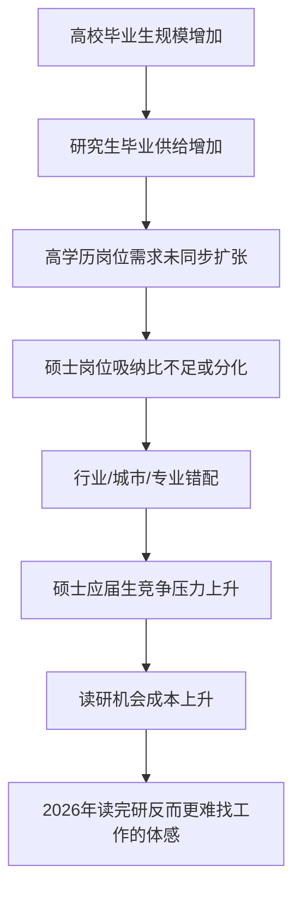

# 毕业生就业为什么难？

## 项目简介

本项目聚焦一个近几年越来越常见的求职现象：

> 很多人在本科毕业时因为就业压力选择读研，或者但到了 2026 年硕士毕业后，却发现自己好像并没有比本科毕业时更好找工作，甚至感觉更难了。

这个现象不能简单归因于“读研没用”或“学历贬值”。高校毕业生规模持续扩大、研究生毕业供给增加、市场化岗位没有同步“硕士化”、热门行业招聘结构变化、专业错配、城市错配、就业预期变化和读研机会成本共同作用，导致部分硕士毕业生在求职中出现强烈落差。

本项目希望通过公开数据、招聘岗位样本、就业报告和结构化分析，回答以下问题：

**为什么 2026 年很多硕士毕业生会觉得，读完研反而找不到比本科毕业的工作了？**

---

## 项目定位

本项目希望用数据分析拆解一个复杂的社会现象。

基本判断是：

> 读研的价值没有消失，但“学历本身”的自动溢价正在下降。
> 在 2026 年的就业市场中，硕士学历是否有用，越来越取决于学校平台、专业壁垒、产业方向、实习经历、项目能力、城市选择和岗位匹配程度。

---

## 核心研究问题

本项目主要回答六个问题：

### 1. 高校毕业生供给是否显著增加？

分析 2020—2026 年中国高校毕业生总规模、本科毕业生规模、研究生毕业生规模、硕士毕业生规模的变化趋势。

### 2. 研究生毕业生是否增长更快？

分析研究生扩招、考研热和毕业释放之间的时间滞后效应，解释为什么考研报名人数下降并不意味着硕士就业压力立刻下降。

### 3. 企业岗位需求是否同步“硕士化”？

分析应届岗位中的学历要求结构，重点关注本科及以上、硕士及以上、博士岗位的比例变化。

### 4. 哪些行业和城市真正需要硕士？

计算分行业、分城市的“硕士岗位吸纳比”，比较互联网、半导体、金融、教育科研、制造业、公共部门等行业对硕士学历的真实需求差异。

### 5. 硕士毕业生的真实竞争对手是谁？

比较以下几类群体的就业位置：

* 2026 届硕士应届毕业生
* 2026 届本科应届毕业生
* 2023 届本科毕业后直接工作、到 2026 年已有三年经验的人
* 其他硕士、博士、海归和社招低年限候选人

### 6. 读研的机会成本是否上升？

通过情景模拟分析本科直接就业与读研三年的路径差异，评估读研是否真正提升了职业资本。

---

## 分析框架

本项目采用以下分析框架：



核心逻辑是：

> 就业难不是单纯因为毕业生变多，而是因为高学历毕业生增长速度、岗位需求结构、行业吸纳能力和求职者预期之间发生了错配。

---

## 方法论

本项目主要采用五类方法：

### 1. 供需结构分析

从供给侧和需求侧同时分析就业压力。

供给侧包括：

* 高校毕业生人数
* 本科毕业生人数
* 硕士毕业生人数
* 博士毕业生人数
* 各学科门类毕业生人数
* 各地区高校毕业生人数

需求侧包括：

* 应届岗位数
* 校招岗位数
* 硕士及以上岗位数
* 博士岗位数
* 经验不限岗位数
* 各行业岗位数
* 各城市岗位数
* 岗位薪资水平

### 2. 错配分析

重点分析五类错配：

* 学历错配：硕士毕业生供给增长，但硕士岗位需求没有同步增长
* 专业错配：部分专业毕业生规模大，但对口岗位不足
* 行业错配：毕业生集中竞争少数热门行业
* 城市错配：毕业生集中流向一线和新一线城市
* 预期错配：求职者期望岗位与市场实际岗位之间存在差距

### 3. 队列比较

比较不同教育和就业路径下的候选人竞争力：

* 本科毕业直接工作的人
* 本科毕业后读研的人
* 当前本科应届生
* 当前硕士应届生
* 有 1—3 年经验的社招候选人

### 4. 反事实分析

通过情景模拟回答：

> 如果一个人本科毕业后不读研，而是直接工作，到 2026 年会不会比硕士应届毕业更有竞争力？

### 5. 证据三角验证

为了降低单一数据源偏差，本项目采用三类证据互相验证：

* 官方统计数据
* 招聘平台公开报告
* 自建岗位样本数据

---

## 核心指标体系

### 1. 毕业生供给指标

| 指标       | 含义                    |
| -------- | --------------------- |
| 高校毕业生规模  | 当年高校毕业生总人数            |
| 本科毕业生规模  | 当年普通本科毕业生人数           |
| 研究生毕业生规模 | 当年研究生毕业生人数            |
| 硕士毕业生规模  | 当年硕士毕业生人数             |
| 博士毕业生规模  | 当年博士毕业生人数             |
| 研究生毕业生占比 | 研究生毕业生 / 高校毕业生总数      |
| 毕业生同比增速  | 当年毕业生人数 / 上年毕业生人数 - 1 |

### 2. 岗位需求指标

| 指标       | 含义                    |
| -------- | --------------------- |
| 应届岗位数    | 面向应届毕业生或可接受应届生的岗位数量   |
| 校招岗位数    | 明确标注为校园招聘的岗位数量        |
| 本科及以上岗位数 | 学历要求为本科及以上的岗位数量       |
| 硕士及以上岗位数 | 学历要求为硕士及以上的岗位数量       |
| 博士岗位数    | 学历要求为博士的岗位数量          |
| 经验不限岗位数  | 工作经验要求为不限或可接受应届生的岗位数量 |

### 3. 高学历岗位吸纳比

本项目最核心的指标是：

```text
硕士硬性吸纳比 =
明确要求硕士及以上的应届岗位数 / 应届岗位总数
```

同时计算扩展指标：

```text
硕士偏好吸纳比 =
明确要求硕士及以上或标注硕士优先的应届岗位数 / 应届岗位总数
```

分行业指标：

```text
行业硕士吸纳比 =
某行业要求硕士及以上的应届岗位数 / 某行业应届岗位总数
```

分城市指标：

```text
城市硕士吸纳比 =
某城市要求硕士及以上的应届岗位数 / 某城市应届岗位总数
```

行业 × 城市交叉指标：

```text
行业城市硕士吸纳比 =
某城市某行业要求硕士及以上的应届岗位数 / 某城市某行业应届岗位总数
```

### 4. 学历错配指数

```text
学历错配指数 =
某学历毕业生供给占比 - 某学历岗位需求占比
```

例如：

```text
硕士学历错配指数 =
硕士毕业生占毕业生比例 - 硕士岗位占应届岗位比例
```

如果该指标持续扩大，说明硕士供给增长快于市场对硕士岗位的吸纳能力。

### 5. 读研机会成本

```text
读研机会成本 =
本科直接工作三年累计收入
+ 三年工作经验带来的薪资溢价
- 读研期间收入或补贴
- 硕士毕业后的薪资增量
```

该指标用于解释为什么部分人会产生“读完研反而不如本科直接工作”的体感。

---

## 数据来源

本项目计划使用以下数据来源。

### 1. 官方统计数据

主要用于分析毕业生供给和宏观就业环境。

可能来源包括：

* 教育部全国教育事业发展统计公报
* 国家统计局国民经济和社会发展统计公报
* 人力资源和社会保障部公开数据
* 中国教育统计年鉴
* 各省市教育统计公报

### 2. 招聘平台公开报告

主要用于分析岗位需求结构、应届生招聘变化、学历要求变化和行业招聘趋势。

可能来源包括：

* 智联招聘大学生就业力调研报告
* 猎聘大学生就业供需洞察报告
* BOSS 直聘应届生就业趋势报告
* 前程无忧校园招聘相关报告
* 脉脉人才流动报告
* 麦可思中国大学生就业报告

### 3. 岗位样本数据

本项目计划基于公开岗位信息建立岗位样本库，用于计算学历要求、行业分布、城市分布和硕士岗位吸纳比。

可能来源包括：

* 中国公共招聘网
* 国家大学生就业服务平台
* 国聘
* 央企校招平台
* 地方人才网
* 高校就业信息网
* 招聘平台公开页面

注意：岗位样本采集应遵守平台规则，不采集个人隐私，不绕过登录、验证码或反爬机制。

### 4. 高校就业质量报告

主要用于补充分学历、分专业、分行业、分单位性质的毕业去向信息。

可能来源包括：

* 高校毕业生就业质量年度报告
* 双一流高校就业质量报告
* 地方本科院校就业质量报告
* 高职院校就业质量报告

---

## 项目目录结构

```text
graduate-employment-pressure-analysis-2026/
│
├── README.md
├── requirements.txt
├── .gitignore
├── LICENSE
│
├── data/
│   ├── raw/
│   │   ├── official_statistics/
│   │   ├── recruitment_reports/
│   │   ├── job_posting_samples/
│   │   └── university_employment_reports/
│   │
│   ├── interim/
│   ├── processed/
│   └── data_dictionary/
│
├── notebooks/
│   ├── 00_project_question_definition.ipynb
│   ├── 01_graduate_supply_analysis.ipynb
│   ├── 02_postgraduate_supply_analysis.ipynb
│   ├── 03_job_demand_structure_analysis.ipynb
│   ├── 04_master_absorption_ratio_analysis.ipynb
│   ├── 05_industry_city_mismatch_analysis.ipynb
│   ├── 06_cohort_comparison_and_opportunity_cost.ipynb
│   ├── 07_key_findings_for_video_storytelling.ipynb
│   └── 99_final_charts_export.ipynb
│
├── src/
│   ├── data_collection/
│   ├── data_cleaning/
│   ├── features/
│   ├── analysis/
│   └── visualization/
│
├── reports/
│   ├── figures/
│   ├── tables/
│   ├── final_report.md
│   └── executive_summary.md
│
├── docs/
│   ├── research_design.md
│   ├── methodology.md
│   ├── data_sources.md
│   ├── indicator_system.md
│   ├── limitations.md
│   └── video_script_outline.md
│
└── dashboard/
    ├── streamlit_app.py
    └── dashboard_design.md
```

---

## Notebook 说明

### 00_project_question_definition.ipynb

定义研究问题、研究边界、核心假设、数据来源和指标口径。

### 01_graduate_supply_analysis.ipynb

分析 2020—2026 年高校毕业生规模变化，包括高校毕业生总量、本科毕业生和研究生毕业生变化。

### 02_postgraduate_supply_analysis.ipynb

重点分析研究生扩招、考研报名人数变化和研究生毕业释放之间的关系。

### 03_job_demand_structure_analysis.ipynb

分析岗位需求结构，包括学历要求、经验要求、行业分布和城市分布。

### 04_master_absorption_ratio_analysis.ipynb

计算核心指标：硕士岗位吸纳比。包括总体吸纳比、分行业吸纳比、分城市吸纳比和行业 × 城市交叉吸纳比。

### 05_industry_city_mismatch_analysis.ipynb

分析行业、城市和学历之间的结构性错配。

### 06_cohort_comparison_and_opportunity_cost.ipynb

比较本科直接就业和读研三年后的不同路径，进行读研机会成本模拟。

### 07_key_findings_for_video_storytelling.ipynb

将数据分析结果转化为视频解说素材，包括核心发现、图表、旁白和证据链。

### 99_final_charts_export.ipynb

统一导出最终报告和视频中需要使用的图表。

---

## 预期图表

本项目计划输出以下图表：

| 图表                    | 用途              |
| --------------------- | --------------- |
| 2020—2026 高校毕业生规模趋势图  | 展示毕业生总量压力       |
| 2020—2026 研究生毕业生规模趋势图 | 展示研究生供给增长       |
| 考研报名人数变化趋势图           | 展示考研热降温与毕业释放错位  |
| 应届岗位学历要求分布图           | 展示岗位是否“硕士化”     |
| 分行业硕士岗位吸纳比柱状图         | 比较哪些行业更需要硕士     |
| 分城市硕士岗位吸纳比柱状图         | 比较哪些城市更吸纳硕士     |
| 行业 × 城市硕士吸纳比热力图       | 展示结构性机会差异       |
| 学历错配指数趋势图             | 展示硕士供给与岗位需求是否错配 |
| 本科直接工作 vs 读研三年路径图     | 展示读研机会成本        |
| 视频结论证据链图              | 支撑最终解说视频        |

---

## 预期结论方向

本项目并不预设结论，但初步研究假设包括：

### 假设 1：毕业生总供给增加是就业压力上升的重要背景

高校毕业生规模持续增长，使应届生市场竞争加剧。

### 假设 2：研究生毕业生增长快于高学历岗位增长

研究生供给增加，但要求硕士及以上的岗位没有同步增长，导致普通硕士学历的边际优势下降。

### 假设 3：硕士岗位吸纳能力高度分化

半导体、医药研发、教育科研、部分金融投研和公共部门可能更需要硕士；但互联网运营、销售、职能、一般制造业和部分基础岗位仍以本科及以上为主。

### 假设 4：硕士应届生的真实竞争对手不是单纯的本科应届生

硕士应届生不仅要和本科应届生竞争校招岗位，还要面对已有 1—3 年经验的本科毕业生、其他硕士、博士和海归候选人。

### 假设 5：读研是否值得，取决于是否转化为职业资本

如果读研期间没有形成专业壁垒、实习经历、项目成果、行业入口和可验证技能，那么读研可能只是延迟就业，而不是提升就业竞争力。

---

## 视频转化思路

本项目最终会转化为一份讲解视频素材，暂定标题为：

> 2026年，读完研反而找不到本科毕业时候的工作了？

视频结构如下：

### 开头：一个反直觉现象

2023 年，为了避开就业压力，很多人选择考研。
三年后，2026 年，他们拿着硕士学历重新进入市场，却发现求职并没有更容易。

### 第一章：不是错觉，毕业生真的更多了

用高校毕业生趋势图解释总量压力。

### 第二章：研究生也不再稀缺

用研究生毕业生趋势图解释高学历供给增加。

### 第三章：岗位没有同步硕士化

用岗位学历要求分布图解释市场需求结构。

### 第四章：哪些行业真的需要硕士？

用行业硕士吸纳比图解释行业差异。

### 第五章：硕士真正输给了谁？

用队列比较解释硕士应届生、本科应届生和本科三年经验者的竞争关系。

### 第六章：读研不是没用，而是不能只靠学历

总结读研价值从“学历本身”转向“职业资本”。

---

## 项目局限性

本项目存在以下局限：

1. 招聘岗位样本不能代表全国完整就业市场。
2. 不同招聘平台的用户结构和岗位结构存在差异。
3. 部分公开报告只提供汇总数据，不提供原始明细数据。
4. 高校就业质量报告口径不完全一致。
5. “找不到工作”与“找不到理想工作”需要严格区分。
6. 岗位数量不能完全代表真实招聘人数，因为一个岗位可能对应多个招聘名额，也可能只是长期挂出的岗位。
7. 硕士就业难度存在显著专业、学校、城市和行业差异，不能用总体数据替代个体判断。

---

## 如何运行项目

### 1. 创建 Python 环境

```bash
python -m venv .venv
```

Windows PowerShell：

```bash
.venv\Scripts\activate
```

macOS / Linux：

```bash
source .venv/bin/activate
```

### 2. 安装依赖

```bash
pip install -r requirements.txt
```

### 3. 启动 Jupyter Notebook

```bash
jupyter notebook
```

### 4. 运行分析 Notebook

建议按照以下顺序运行：

```text
00_project_question_definition.ipynb
01_graduate_supply_analysis.ipynb
02_postgraduate_supply_analysis.ipynb
03_job_demand_structure_analysis.ipynb
04_master_absorption_ratio_analysis.ipynb
05_industry_city_mismatch_analysis.ipynb
06_cohort_comparison_and_opportunity_cost.ipynb
07_key_findings_for_video_storytelling.ipynb
99_final_charts_export.ipynb
```

---

## 当前进度

* [x] 项目选题确定
* [x] 分析框架设计
* [x] GitHub 目录结构设计
* [ ] 官方统计数据整理
* [ ] 招聘报告整理
* [ ] 岗位样本采集
* [ ] 指标口径文档完善
* [ ] 供给侧分析
* [ ] 需求侧分析
* [ ] 硕士岗位吸纳比计算
* [ ] 行业城市错配分析
* [ ] 机会成本模拟
* [ ] 最终报告撰写
* [ ] 视频脚本生成

---

## 许可说明

本项目仅用于学习、研究和公共讨论。
数据来源于公开统计、公开报告和公开岗位样本。
如引用本项目内容，请注明来源。

---

## 作者说明

本项目由个人独立完成，用于个人好奇满足。

项目目标不是制造焦虑，而是用结构化数据解释一个真实存在的就业体感：

> 不是每一个研究生都更难就业，
> 而是 2026 年的就业市场已经不再为“更高学历”自动买单。
