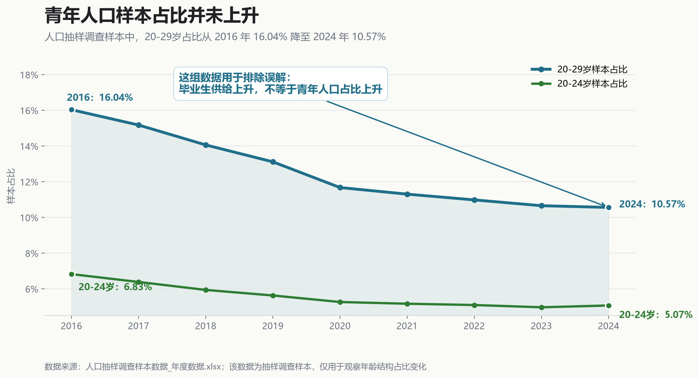
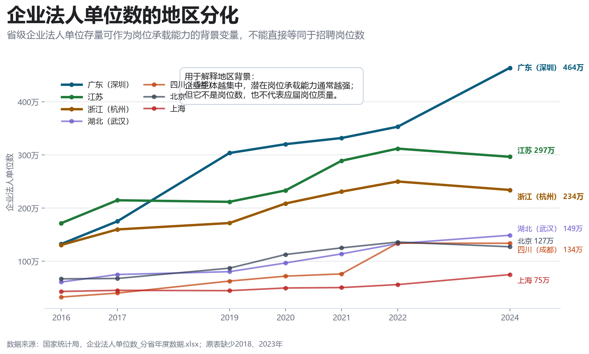
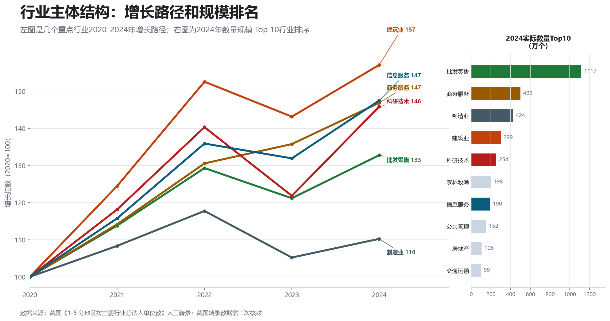
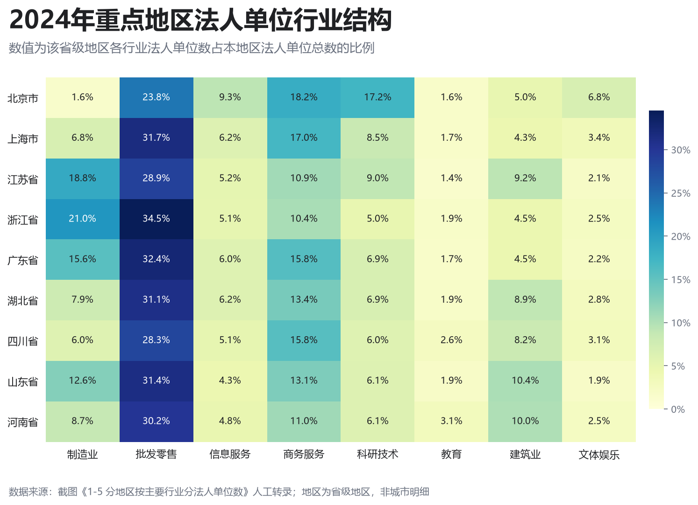
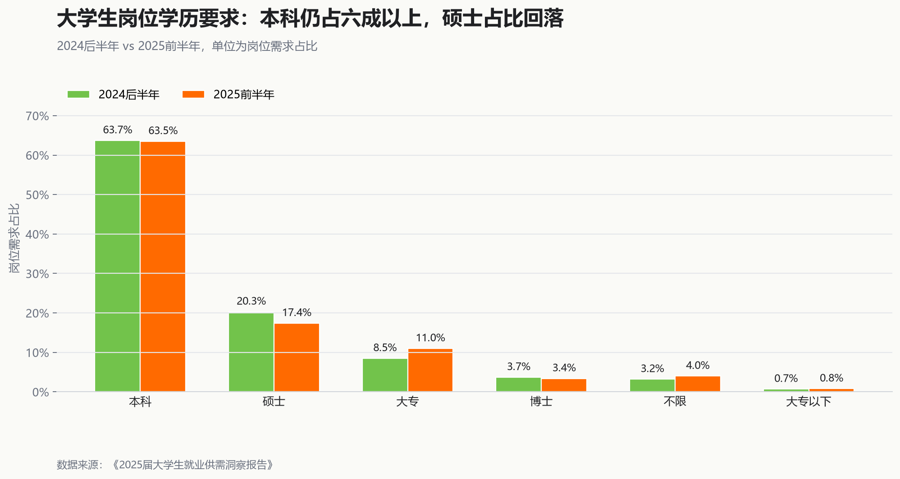
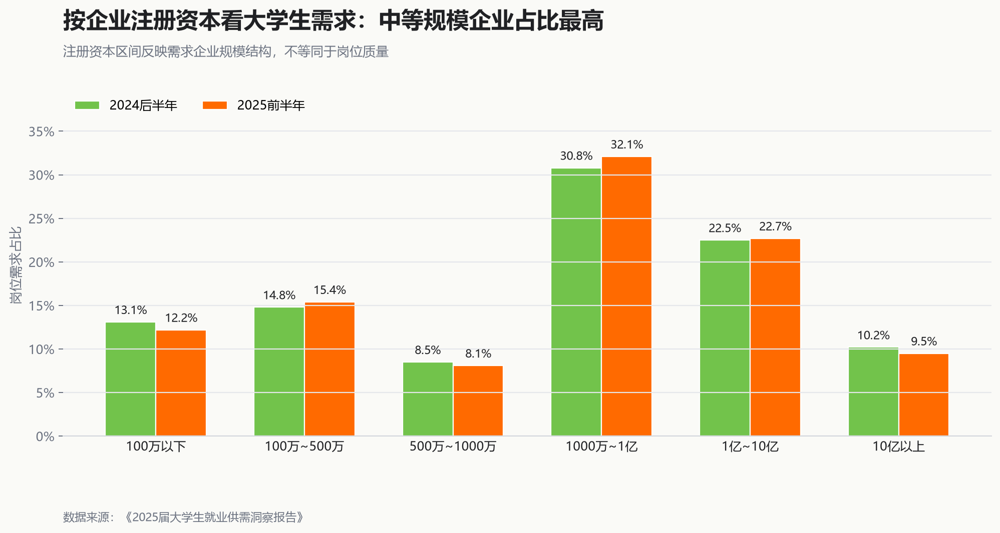
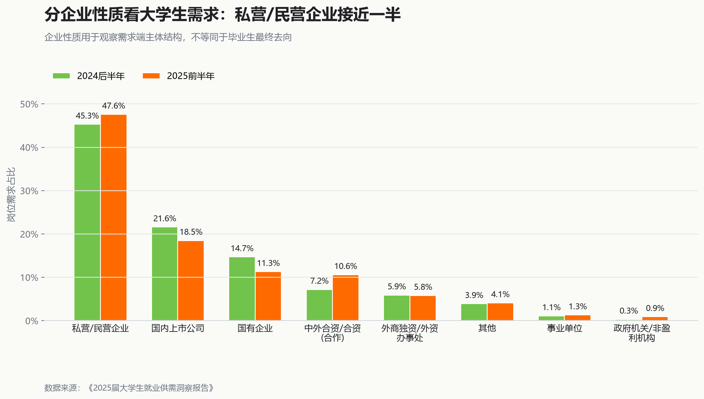

# 2026年，读完研反而更难找工作了吗？

## 补充背景：青年人口占比并未上升

在解释高校毕业生就业压力时，一个容易出现的误解是：就业压力变大，可能只是因为年轻人越来越多。人口抽样调查样本数据提供了一个背景参照。

从样本年龄结构看，20—29岁人口样本占比从2016年的16.04%下降到2024年的10.57%；20—24岁人口样本占比也从2016年的6.83%下降到2024年的5.07%。这说明，近年高校毕业生供给上升，并不能简单归因于青年人口总体占比上升。

需要注意的是，该数据来自人口抽样调查样本，适合观察年龄结构占比变化，不代表全国实际人口规模。它在本报告中的作用不是直接解释就业难，而是作为背景证据，帮助排除一个过于简单的解释：不是因为青年人口占比整体上升，才导致硕士毕业生求职体感恶化。更关键的分析仍然需要回到高校毕业生供给扩张、研究生学历供给增加、岗位需求结构变化和行业城市错配。

## 补充背景：企业主体存量存在明显地区分化

企业法人单位数可以作为地区就业承载能力的背景变量。它不能直接代表招聘岗位数，更不能代表应届岗位、硕士岗位或高质量岗位数量；但它可以帮助判断不同地区的企业主体基础是否存在明显差异。

从重点省级地区看，广东、江苏、浙江的企业法人单位数长期处于较高水平，且与北京、上海、湖北、四川之间存在明显量级差异。对于本项目关注的城市而言，北京、上海可以直接用直辖市数据观察；深圳、杭州、武汉、成都则分别需要借助广东、浙江、湖北、四川作为省级背景参照。

这张图适合放在需求侧分析之前，作为一个过渡：即使毕业生供给是全国性增长，岗位机会也不会在全国均匀分布。后续真正判断硕士求职压力，仍需要进入岗位样本层面，计算不同行业、城市中明确要求硕士及以上学历的岗位比例。

## 需求侧结构背景：规模排名与增长路径要分开读

从截图《1-5 分地区按主要行业分法人单位数》转录的数据看，按2024年法人单位数排序，前10行业包括批发零售、商务服务、制造业、建筑业、科研技术、农林牧渔、信息服务、公共管理、房地产和交通运输。图中右侧条形图显示的是2024年实际数量排名，左侧折线图只高亮批发零售、商务服务、制造业、建筑业、科研技术和信息服务6个与就业需求叙事更相关的行业，并显示以2005年为100的增长指数。两者不能混读：增长指数高，说明相对自身基数扩张快，不等于2024年实际规模最大。

这组数据不能直接代表岗位数量，但可以作为需求侧结构变化的背景：市场主体增长更快的领域，往往对应更多新职业、新职能和知识服务型岗位。但这并不自动意味着硕士岗位同步增加，因为岗位是否要求硕士，还取决于具体行业、职能、城市和企业招聘策略。

从2024年重点地区的行业结构看，不同省级地区的法人单位结构也存在明显差异。浙江、广东、江苏的批发零售和制造业占比较高；北京的科研技术服务和信息服务占比更突出；四川、湖北、河南等地区的行业结构则更接近综合型省份。

因此，后续岗位样本分析需要进一步回答：这些行业主体增长是否真的转化成了应届岗位、高质量岗位，以及明确要求硕士学历的岗位。如果行业主体增长主要发生在低学历门槛岗位或非校招岗位上，它对硕士应届生求职体感的改善就会有限。

需要注意的是，本节数据来自截图人工转录，已经在项目中标记为 `needs_review`。质量检查表中记录了少量合计与分项求和差异，后续如能获得原始 Excel 或官方数据库文件，应优先替换当前转录数据。

## 招聘报告摘录：大学生岗位需求结构

猎聘大数据截图可以作为需求侧结构的补充证据。它们不替代后续岗位样本分析，但能帮助报告先回答一个背景问题：招聘市场是否正在明显“硕士化”。

从岗位学历要求看，本科仍然占大学生岗位需求的六成以上，2024后半年为63.7%，2025前半年为63.5%；硕士岗位占比则从20.3%降至17.4%。这说明至少在这组猎聘截图口径下，岗位学历结构没有表现出同步向硕士扩张的趋势。

从企业注册资本看，大学生需求主要集中在 `[1000万,1亿]` 和 `[1亿,10亿]` 两个区间，2025前半年分别为32.1%和22.7%。这部分更适合作为需求企业规模结构的背景，而不是岗位质量的直接指标。

从企业性质看，私营/民营企业占比接近一半，2025前半年达到47.6%；国内上市公司和国有企业占比则低于2024后半年。这一结果提醒我们，大学生岗位需求的主体仍然高度依赖市场化企业，因此宏观就业体感会受到民营部门招聘节奏影响。

这组三张图在报告中的合理用法，是作为“需求侧并未自动高学历化”的招聘报告摘录证据。它不能直接推出全国硕士岗位占比下降，也不能替代 `job_demand_panel.csv` 中基于岗位样本计算的硕士硬性吸纳比和硕士偏好吸纳比。
